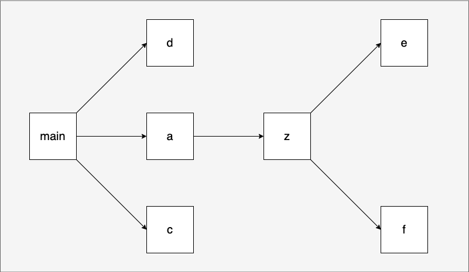

<!-- START doctoc generated TOC please keep comment here to allow auto update -->
<!-- DON'T EDIT THIS SECTION, INSTEAD RE-RUN doctoc TO UPDATE -->
**Table of Contents**  *generated with [DocToc](https://github.com/thlorenz/doctoc)*

- [Overview](#overview)
- [PGO](#pgo)
- [min、max](#minmax)
- [clear](#clear)
- [明确了包初始化顺序算法](#%E6%98%8E%E7%A1%AE%E4%BA%86%E5%8C%85%E5%88%9D%E5%A7%8B%E5%8C%96%E9%A1%BA%E5%BA%8F%E7%AE%97%E6%B3%95)
- [泛型类型增强](#%E6%B3%9B%E5%9E%8B%E7%B1%BB%E5%9E%8B%E5%A2%9E%E5%BC%BA)
- [修复panic(nil)语义](#%E4%BF%AE%E5%A4%8Dpanicnil%E8%AF%AD%E4%B9%89)
- [loop var per-loop -> loop var per-iteration](#loop-var-per-loop---loop-var-per-iteration)

<!-- END doctoc generated TOC please keep comment here to allow auto update -->

# Overview

2023 年 8 月 8 日

工具改进

我们宣布在 1.20 中预览的配置文件引导优化 (PGO) 功能现已全面推出！default.pgo如果主包目录中存在名为的文件 ，该go命令将使用它来启用 PGO 构建。有关更多详细信息，请参阅PGO 文档。我们测量了 PGO 对多种 Go 程序的影响，发现性能提高了 2-7%。

该go工具现在支持向后 和向前语言兼容性。

语言变化

- 新的内置函数：min、max 和clear。
- 对泛型函数的类型推断进行了多项改进。规范中类型推断的描述 已得到扩展和澄清。
- 在 Go 的未来版本中，我们计划解决 Go 编程中最常见的问题之一： 循环变量捕获。Go 1.21 附带了此功能的预览版，您可以使用环境变量在代码中启用该功能。有关更多详细信息，请参阅LoopvarExperiment wiki 页面。

标准库添加

- 用于结构化日志记录的新log/slog包。
- 新的slices包，用于对任何元素类型的切片进行常见操作。这包括通常比排序包更快、更符合人体工程学的排序功能。
- 新的maps包，用于对任何键或元素类型的地图进行常见操作。
- 新的cmp软件包具有用于比较有序值的新实用程序。

提高性能

- 除了启用 PGO 时的性能改进之外：
- Go 编译器本身已经在 1.21 中启用了 PGO 进行了重建，因此它构建 Go 程序的速度提高了 2-4%，具体取决于主机架构。
- 由于垃圾收集器的调整，某些应用程序的尾部延迟可能会减少高达 40%。
- 现在，使用runtime/trace收集跟踪在 amd64 和 arm64 上的 CPU 成本要小得多。

WASI 的新港口

- Go 1.21 添加了WebAssembly 系统接口 (WASI)的实验端口，预览版 1 ( GOOS=wasip1, GOARCH=wasm)。
- 为了方便编写更通用的 WebAssembly (Wasm) 代码，编译器还支持从 Wasm 主机导入函数的新指令： go:wasmimport。

# PGO

https://go.dev/doc/pgo

PGO 通过缩小代码大小、减少分支错误预测和重新组织代码布局以减少指令缓存问题来提高应用程序性能。

Go 编译器期望 CPU pprof 配置文件作为 PGO 的输入。由 Go 运行时生成的配置文件（例如从runtime/pprof和net/http/pprof 生成的配置文件）可以直接用作编译器输入。

构建的标准方法是将**pprof CPU 配置文件及其文件名存储default.pgo**在分析二进制文件的主包目录中。默认情况下，go build将自动检测default.pgo文件并启用 PGO。

```Go
// Go 运行时（通过runtime/pprof等）生成的 CPU 配置文件已经采用正确的格式，可以直接用作 PGO 输入。

go run .
curl -o cpu.pprof "http://localhost:8080/debug/pprof/profile?seconds=30"
mv cpu.pprof default.pgo
go build -o xxx
```

# min、max

min和max函数分别返回参数列表中的最小值和最大值，它们都是泛型函数

```Go
func min[T cmp.Ordered](x T, y ...T) T
func max[T cmp.Ordered](x T, y ...T) T

type Ordered interface {
    ~int | ~int8 | ~int16 | ~int32 | ~int64 |
        ~uint | ~uint8 | ~uint16 | ~uint32 | ~uint64 | ~uintptr |
        ~float32 | ~float64 |
        ~string
}
```

通过原型我们看到，使用这两个函数时，参数的类型要相同，且至少要传入一个参数

```Go
var x, y int = 5, 6
fmt.Println(max(x))                    // 5
fmt.Println(max(x, y, 0))              // 6
fmt.Println(max("aby", "tony", "tom")) // tony

// 参数同会报错
var f float64 = 5.6
fmt.Printf("%T\n", max(x, y, f))    // invalid argument: mismatched types int (previous argument) and float64 (type of f)
fmt.Printf("%T\n", max(x, y, 10.1)) // (untyped float constant) truncated to int
```

# clear

```Go
func clear[T ~[]Type | ~map[Type]Type1](t T)
```

从原型来看，clear的操作对象是切片和map类型，不过其执行语义因依操作的对象类型而异。

```Go
var sl = []int{1, 2, 3, 4, 5, 6}
fmt.Printf("before clear, sl=%v, len(sl)=%d, cap(sl)=%d\n", sl, len(sl), cap(sl))
clear(sl)
fmt.Printf("after clear, sl=%v, len(sl)=%d, cap(sl)=%d\n", sl, len(sl), cap(sl))

var m = map[string]int{
    "tony": 13,
    "tom":  14,
    "amy":  15,
}
fmt.Printf("before clear, m=%v, len(m)=%d\n", m, len(m))
clear(m)
fmt.Printf("after clear, m=%v, len(m)=%d\n", m, len(m))
```

- 针对slice，clear保持slice的长度和容量，但将所有slice内已存在的元素(len个)都置为元素类型的零值；
- 针对map，clear则是清空所有map的键值对，clear后，我们将得到一个empty map。

# 明确了包初始化顺序算法



# 泛型类型增强

Go 1.21版本对泛型的类型推断能力做了增强。

- 部分实例化的泛型函数(Partially instantiated generic functions)
- 接口赋值推断(Interface assignment inference)

```Go
// lang/type_inference/interface_assignment_inference.go

type Indexable[T any] interface {
    At(i int) (T, bool)
}

func Index[T any](elems Indexable[T], i int) (T, bool) {
    return elems.At(i)
}

type MyList[T any] []T

func (m MyList[T]) At(i int) (T, bool) {
    var zero T
    if i > len(m) {
        return zero, false
    }
    return m[i], true
}

func main() {
    var m = MyList[int]{11, 12, 13}
    fmt.Println(Index(m, 2))
}
```

- 对无类型常量的类型推断(Type inference for untyped constants)

```Go
// lang/type_inference/untyped_constants_inference.go

func Sum[T int | float64](a ...T) T {
    var sum T
    for _, v := range a {
        sum += v
    }
    return sum
}

func main() {
    fmt.Printf("%T\n", Sum(1, 2, 3.5)) // 之前版本会报错 会把1,2 当成int
}
```

# 修复panic(nil)语义

在Go 1.21中，Go编译器会将panic(nil)替换为panic(new(runtime.PanicNilError))，`panic: panic called with nil argument`

如果你要恢复原先的语义，可以使用GODEBUG=panicnil=1这个功能开关。

#  loop var per-loop -> loop var per-iteration

```Go
package main

import (
        "fmt"
        "time"
)

func main() {
        var m = [...]int{1, 2, 3, 4, 5}

        for i, v := range m {
                go func() {
                        time.Sleep(time.Second * 3)
                        fmt.Println(i, v)
                }()
        }

        time.Sleep(time.Second * 10)
}
GOEXPERIMENT=loopvar go run classic_for_loop_in_1_21.go
```

新语义仅在GOEXPERIMENT=loopvar且在for语句(包括for range)的前置条件表达式中使用短变量声明循环变量时才生效。

Go团队决定在Go 1.22版本移除这个“坑”，
