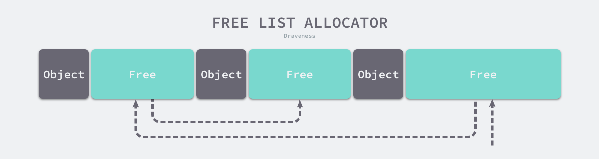

<!-- START doctoc generated TOC please keep comment here to allow auto update -->
<!-- DON'T EDIT THIS SECTION, INSTEAD RE-RUN doctoc TO UPDATE -->
**Table of Contents**  *generated with [DocToc](https://github.com/thlorenz/doctoc)*

- [Overview](#overview)
- [分配方法](#%E5%88%86%E9%85%8D%E6%96%B9%E6%B3%95)
  - [线性分配器](#%E7%BA%BF%E6%80%A7%E5%88%86%E9%85%8D%E5%99%A8)
  - [空闲链表分配器](#%E7%A9%BA%E9%97%B2%E9%93%BE%E8%A1%A8%E5%88%86%E9%85%8D%E5%99%A8)
- [内存分配](#%E5%86%85%E5%AD%98%E5%88%86%E9%85%8D)
- [垃圾收集](#%E5%9E%83%E5%9C%BE%E6%94%B6%E9%9B%86)
  - [STW](#stw)
  - [三色标记法原理](#%E4%B8%89%E8%89%B2%E6%A0%87%E8%AE%B0%E6%B3%95%E5%8E%9F%E7%90%86)
  - [垃圾回收优化](#%E5%9E%83%E5%9C%BE%E5%9B%9E%E6%94%B6%E4%BC%98%E5%8C%96)
    - [写屏障(Write Barrier)](#%E5%86%99%E5%B1%8F%E9%9A%9Cwrite-barrier)
    - [辅助GC(Mutator Assist)](#%E8%BE%85%E5%8A%A9gcmutator-assist)
  - [垃圾回收触发时机](#%E5%9E%83%E5%9C%BE%E5%9B%9E%E6%94%B6%E8%A7%A6%E5%8F%91%E6%97%B6%E6%9C%BA)
    - [内存分配量达到阀值触发GC](#%E5%86%85%E5%AD%98%E5%88%86%E9%85%8D%E9%87%8F%E8%BE%BE%E5%88%B0%E9%98%80%E5%80%BC%E8%A7%A6%E5%8F%91gc)
    - [定期触发GC](#%E5%AE%9A%E6%9C%9F%E8%A7%A6%E5%8F%91gc)
    - [手动触发](#%E6%89%8B%E5%8A%A8%E8%A7%A6%E5%8F%91)
- [内存逃逸](#%E5%86%85%E5%AD%98%E9%80%83%E9%80%B8)
  - [指针逃逸](#%E6%8C%87%E9%92%88%E9%80%83%E9%80%B8)
  - [栈空间不足逃逸](#%E6%A0%88%E7%A9%BA%E9%97%B4%E4%B8%8D%E8%B6%B3%E9%80%83%E9%80%B8)
  - [动态类型逃逸](#%E5%8A%A8%E6%80%81%E7%B1%BB%E5%9E%8B%E9%80%83%E9%80%B8)
  - [闭包引用对象逃逸](#%E9%97%AD%E5%8C%85%E5%BC%95%E7%94%A8%E5%AF%B9%E8%B1%A1%E9%80%83%E9%80%B8)
  - [逃逸总结](#%E9%80%83%E9%80%B8%E6%80%BB%E7%BB%93)

<!-- END doctoc generated TOC please keep comment here to allow auto update -->

# Overview

任何程序都只是操作系统下的一个进程罢了。操作系统会负责给我们的程序分配内存资源。

从逻辑层面将进程数据分为5个段。

- `代码段（text segment）`: 通常指存放程序执行代码的区域，这部分区域大小在程序运行前就已经确定，并且通常属于只读。代码段中也可能包含一些只读常数变量，例如字符串常量等。
- `bss段（bss segment）`: 存放未初始化的全局变量和静态变量，可读写。
- `数据段（data segment）`:存储初始化的全局变量和初始化的静态变量，可读写。
- `堆（heap）`：用于存放进程运行中动态分配的内存段，它的大小并不固定，可动态扩张或缩减。当进程调用malloc等函数分配内存时，新分配的内存就被动态添加到堆上（堆被扩张）；当利用free等函数释放内存时，被释放的内存从堆中被剔除（堆被缩减）。
- `栈（stack）`：存放的是函数中的局部变量及调用数据。操作方式与数据结构中的栈类似。当函数执行完成后，该函数的栈帧由操作系统自动从栈区移除。通常栈的大小是固定的，当我们局部变量申请过大，或函数调用太深，就有可能导致栈溢出（StackOverflow）

内存分配一般有三种方式：

- 静态存储区（根对象、静态变量、常量）
- 栈（函数中的临时局部变量）
- 堆（malloc、new等）

内存管理一般包含三个不同的组件:

- 用户程序（Mutator）
- 分配器（Allocator）
- 收集器（Collector）

# 分配方法

## 线性分配器

线性分配（Bump Allocator）是一种高效的内存分配方法。


使用线性分配器分配内存时， 只需要在内存中**维护一个指向内存特定位置都指针**。 当程序申请内存时， 分配器只需要检查剩余的空闲内存，返回分配的内存区域并修改指针在内存中的位置。

- 优点： 执行快，容易实现
- 缺点：**无法重用内存**，需要使用合理的垃圾回收器材可以。


## 空闲链表分配器

空闲链表分配器（Free-List Allocator）可以重用已经被释放的内存，它在内部会维护一个类似链表的数据结构。当用户程序申请内存时，空闲链表分配器会依次遍历空闲的内存块，找到足够大的内存，然后申请新的资源并修改链表：



# 内存分配

堆上所有的对象都会通过调用 `runtime.newobject `函数分配内存，该函数会调用 `runtime.mallocgc` 分配指定大小的内存空间

```go
func newobject(typ *_type) unsafe.Pointer {
    return mallocgc(typ.size, typ, true)
}

func mallocgc(size uintptr, typ *_type, needzero bool) unsafe.Pointer {
  
}
```

- 微对象 `(0, 16B)` — 先使用微型分配器，再依次尝试线程缓存、中心缓存和堆分配内存；
- 小对象 `[16B, 32KB]` — 依次尝试使用线程缓存、中心缓存和堆分配内存；
- 大对象 `(32KB, +∞)` — 直接在堆上分配内存；

内存分配器的组件主要有三个：线程缓存（mcache)，中心缓存（mcentral) ，页堆（mheap)

- 线程缓存（mcache）启动时没有分配任何内存，向中心缓存（central) 申请缓存，并且每个线程只占用一个内存
- 中心缓存（mcentral) 带锁的全局缓存，是全部线程共享
- 页堆`mheap	` 管理全部的中心缓存（mcentral) 。

Go 启动的时候会向操作系统申请一大块内存块(虚拟内存)， 申请的内存会划分成三个部分 `mspans`,`bitmap`,`arena`

- `arena` 就是堆，存储的就是堆上初始化的对象
- `bitmap` 存储的是这个指针是否包含指针，还有一些 GC 信息，标识的是哪些地址保存了对象
- `mspans` 保存了 `GO` 内存管理的基本单元

# 垃圾收集

垃圾回收（GC）也是内存管理的一部分，垃圾如果不清理就没办法再次被分配使用，垃圾内存就是泄露的内存。

Go 语言为了实现高性能的并发垃圾收集器，使用三色抽象、并发增量回收、混合写屏障、调步算法以及用户程序协助等机制将垃圾收集的暂停时间优化至毫秒级以下。

Go 语言的垃圾收集可以分成 暂停（STW）、标记、标记终止和清除

## STW

STW（Stop The World）就是停掉所有的goroutine，专心做垃圾回收，待垃圾回收结束后再恢复goroutine。

**暂停程序**，所有的处理器在这时会进入安全点（Safe point）

## 三色标记法原理

这里的三色，对应了垃圾回收过程中对象的三种状态：

- 灰色：对象还在标记队列中等待
- 黑色：对象已被标记，gcmarkBits对应的位为1（该对象不会在本次GC中被清理）
- 白色：对象未被标记，gcmarkBits对应的位为0（该对象将会在本次GC中被清理）

初始状态下所有对象都是白色的。接着开始扫描根对象，由于根对象引用了对象A、B,那么A、B变为灰色对象，接下来就开始分析灰色对象，分析A时，A没有引用其他对象很快就转入黑色，B引用了D，则B转入黑色的同时还需要将D转为灰色，进行接下来的分析。

最终，黑色的对象会被保留下来，白色对象会被回收掉

## 垃圾回收优化

### 写屏障(Write Barrier)

写屏障就是让goroutine与GC同时运行的手段。

写屏障类似一种开关，在GC的特定时机开启，开启后指针传递时会把指针标记，即本轮不回收，下次GC时再确定。

### 辅助GC(Mutator Assist)

为了防止内存分配过快，在GC执行过程中，如果goroutine需要分配内存，那么这个goroutine会参与一部分GC的工作。

## 垃圾回收触发时机

### 内存分配量达到阀值触发GC

每次内存分配时都会检查当前内存分配量是否已达到阀值，如果达到阀值则立即启动GC。

存增长率由环境变量`GOGC`控制，默认为100，即每当内存扩大一倍时启动GC。

```go
阀值 = 上次GC内存分配量 * 内存增长率
```

> Go1.21 有软内存限制

### 定期触发GC

默认情况下，最长2分钟触发一次GC

`src/runtime/proc.go`

```go
// This is a variable for testing purposes. It normally doesn't change.
var forcegcperiod int64 = 2 * 60 * 1e9
```

### 手动触发

程序代码中也可以使用`runtime.GC()`来手动触发GC。这主要用于GC性能测试和统计。

# 内存逃逸

`go build -gcflags=-m`

## 指针逃逸

```go
package main

type Student struct {
    Name string
    Age  int
}

func StudentRegister(name string, age int) *Student {
    s := new(Student) //局部变量s逃逸到堆

    s.Name = name
    s.Age = age

    return s
}

func main() {
    StudentRegister("Jim", 18)
}

//.\main.go:9: new(Student) escapes to heap
//.\main.go:18: main new(Student) does not escape
```

> 不管是不是指针，在被引用的情况下都会逃逸到堆上

## 栈空间不足逃逸

一般的栈空间是2M

```go
package main

func Slice() {
    s := make([]int, 1000, 1000)

    for index, _ := range s {
        s[index] = index
    }
}

func main() {
    Slice()
}

//.\main.go:4: Slice make([]int, 1000, 1000) does not escape
```

## 动态类型逃逸

interface传参

```go
package main

import "fmt"

func main() {
    s := "Escape"
    fmt.Println(s)
}
//.\main.go:7: s escapes to heap
//.\main.go:7: main ... argument does not escape
```

## 闭包引用对象逃逸

匿名函数也会逃逸

```go
func Fibonacci() func() int {
    a, b := 0, 1
    return func() int {
        a, b = b, a+b
        return a
    }
}

// .\main.go:7: func literal escapes to heap
// .\main.go:7: func literal escapes to heap
```

> 在有引用的情况下都会逃逸到堆上

## 逃逸总结

- 栈上分配内存比在堆中分配内存有更高的效率
- 栈上分配的内存不需要GC处理
- 堆上分配的内存使用完毕会交给GC处理
- 逃逸分析目的是决定内分配地址是栈还是堆
- 逃逸分析在编译阶段完成

> 在有引用的情况下都会逃逸到堆上