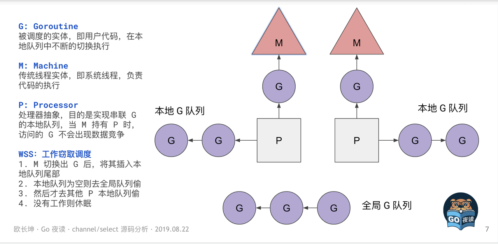

<!-- START doctoc generated TOC please keep comment here to allow auto update -->
<!-- DON'T EDIT THIS SECTION, INSTEAD RE-RUN doctoc TO UPDATE -->
**Table of Contents**  *generated with [DocToc](https://github.com/thlorenz/doctoc)*

- [Overview](#overview)
- [工作窃取调度器](#%E5%B7%A5%E4%BD%9C%E7%AA%83%E5%8F%96%E8%B0%83%E5%BA%A6%E5%99%A8)
- [抢占式调度器](#%E6%8A%A2%E5%8D%A0%E5%BC%8F%E8%B0%83%E5%BA%A6%E5%99%A8)
- [工作线程M](#%E5%B7%A5%E4%BD%9C%E7%BA%BF%E7%A8%8Bm)
- [逻辑处理器P](#%E9%80%BB%E8%BE%91%E5%A4%84%E7%90%86%E5%99%A8p)
- [协程G](#%E5%8D%8F%E7%A8%8Bg)
- [全局调度信息schedt](#%E5%85%A8%E5%B1%80%E8%B0%83%E5%BA%A6%E4%BF%A1%E6%81%AFschedt)
- [调度策略](#%E8%B0%83%E5%BA%A6%E7%AD%96%E7%95%A5)
- [调度时机](#%E8%B0%83%E5%BA%A6%E6%97%B6%E6%9C%BA)
  - [主动调度：](#%E4%B8%BB%E5%8A%A8%E8%B0%83%E5%BA%A6)
  - [被动调度：](#%E8%A2%AB%E5%8A%A8%E8%B0%83%E5%BA%A6)
  - [抢占调度](#%E6%8A%A2%E5%8D%A0%E8%B0%83%E5%BA%A6)

<!-- END doctoc generated TOC please keep comment here to allow auto update -->

# Overview

线程是操作系统调度到CPU中执行的基本单位，多线程总是交替式地抢占CPU的时间片，线程在上下文的切换过程中需要经过操作系统用户态与内核态的切换。

Go 语言在并发编程方面有强大的能力，这离不开语言层面对并发编程的支持。



G: Goroutine

- 被调度的实体，即用户代码，在本地队列中不断的切换执行

M: Machine

- 传统线程实体，即系统线程，负责代码的执行

P: Processor

- 处理器抽象，目的是实现串联 G 的本地队列，当 M 持有 P 时，访问的 G 不会出现数据竞争

> 全局队列有锁，本地队列没锁

# 工作窃取调度器

如果当前运行时在等待垃圾回收，从本地或者全局的运行队列中获取待执行的 Goroutine；

# 抢占式调度器

- 某些 Goroutine 可以长时间占用线程，造成其它 Goroutine 的饥饿；
- 垃圾回收需要暂停整个程序（Stop-the-world，STW），最长可能需要几分钟的时间6，导致整个程序无法工作；

基于协作的抢占式调度

# 工作线程M

工作线程是最终运行协程的实体。操作系统中的线程与在运行时代表线程的m结构体进行了绑定

定义文件：`src/runtime/runtime2.go`

```Go
type m struct {
    g0      *g     // goroutine with scheduling stack
    tls           [tlsSlots]uintptr // thread-local storage (for x86 extern register)
    curg          *g       // current running goroutine
    p             puintptr // attached p for executing go code (nil if not executing go code)
    nextp         puintptr
    oldp          puintptr // the p that was attached before executing a syscall
    park          note
  ...
}
```

为了执行go代码，每一个工作线程m都与一个逻辑处理器p进行绑定

# 逻辑处理器P

系统线程m想要运行用户协程g，必须先绑定逻辑处理器p。在代码中可以通过`runtime.GOMAXPROCS()`具体指定程序运行需要使用多少个逻辑处理器p。通常指定多少个逻辑处理器p最多就可以同时使用到多少个CPU核心数。

```Go
type p struct {
    id          int32
    status      uint32 // one of pidle/prunning/...
  schedtick   uint32     // incremented on every scheduler call
    syscalltick uint32     // incremented on every system call
    m           muintptr   // back-link to associated m (nil if idle)
    // Queue of runnable goroutines. Accessed without lock.
    runqhead uint32
    runqtail uint32
    runq     [256]guintptr
    runnext guintptr
  ... 
}
```

在p中，通过字段m维护了与工作线程m的绑定关系。

# 协程G

协程通常分为特殊的调度协程g0以及执行用户代码的普通协程g。

```Go
type g struct {
  stack       stack       // 描述了当前 Goroutine 的栈内存范围 [stack.lo, stack.hi)
  stackguard0 uintptr     // 用于调度器抢占式调度
  _panic      *_panic     // 最内侧的 panic 结构体
  _defer      *_defer     // 最内侧的 defer 延迟函数结构体
  m           *m          // 当前 G 占用的线程，可能为空
  sched       gobuf       //  存储 G 的调度相关的数据
  atomicstatus uint32     // G 的状态
  goid         int64      //  G 的 ID
  waitreason   waitReason //当状态status==Gwaiting时等待的原因
  preempt       bool      // 抢占信号
  preemptStop   bool      // 抢占时将状态修改成 `_Gpreempted`
  preemptShrink bool      // 在同步安全点收缩栈
  lockedm        muintptr   //G 被锁定只能在这个 m 上运行
  waiting        *sudog     // 这个 g 当前正在阻塞的 sudog 结构体
  ......
}
```

# 全局调度信息schedt

golang协程设计中，除了工作线程m、逻辑处理器p、协程g以外，还存在一个存储全局调度信息的结构体schedt

schedt中维护了

- 空闲的工作线程midle
- 空闲工作线程的数量nmidle
- 等待被释放的线程列表freem
- 系统协程g的数量ngsys
- 空闲逻辑处理器pidle
- 空闲逻辑处理器的数量npidle、
- 以及全局运行队列runq及全局运行队列的大小runqsize、
- 处于新建或者被销毁状态的协程g列表gFree等信息。

schedt中的信息是全局共享的，例如全局运行队列runq被所有p共享，所以schedt中也持有一个锁lock以保证原子性访问。

# 调度策略

从本地运行队列、全局运行队列中查找；

从网络轮询器中查找是否有 Goroutine 等待运行；

尝试从其他随机的处理器中窃取待运行的 Goroutine，该函数还可能窃取处理器的计时器；

# 调度时机

## 主动调度：

协程可以选择主动让渡自己的执行权，这主要通过在代码中主动执行runtime.Gosched()函数实现。

## 被动调度：

当协程休眠、通道堵塞、网络堵塞、垃圾回收导致暂停时，协程会被动让渡出执行的权利给其他可运行的协程继续执行。调度器通过gopark()函数执行被动调度逻辑。gopark()函数最终调用park_m()函数来完成调度逻辑。

## 抢占调度

为了保证每个协程都有执行的机会，系统监控服务会对执行时间过长(大于10ms)的协程、或者处于系统调用(大于20微秒)的协程进行抢占。抢占的核心逻辑通过retake()函数实现