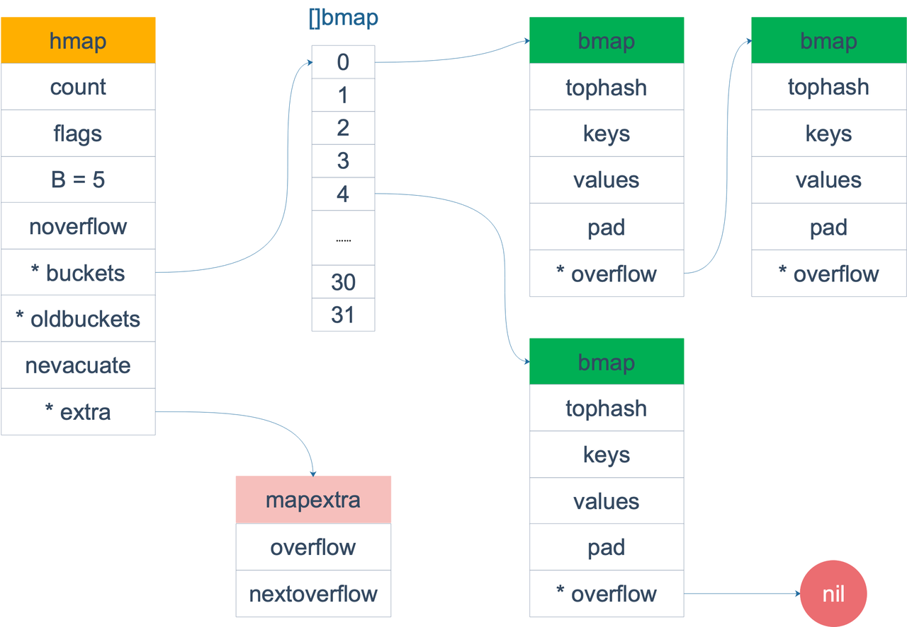

<!-- START doctoc generated TOC please keep comment here to allow auto update -->
<!-- DON'T EDIT THIS SECTION, INSTEAD RE-RUN doctoc TO UPDATE -->
**Table of Contents**  *generated with [DocToc](https://github.com/thlorenz/doctoc)*

- [Overview](#overview)
- [数据结构](#%E6%95%B0%E6%8D%AE%E7%BB%93%E6%9E%84)
- [map架构图](#map%E6%9E%B6%E6%9E%84%E5%9B%BE)
- [创建map](#%E5%88%9B%E5%BB%BAmap)
  - [var创建map](#var%E5%88%9B%E5%BB%BAmap)
  - [new创建map](#new%E5%88%9B%E5%BB%BAmap)
  - [make创建map](#make%E5%88%9B%E5%BB%BAmap)
  - [字面量创建map](#%E5%AD%97%E9%9D%A2%E9%87%8F%E5%88%9B%E5%BB%BAmap)
- [查找元素](#%E6%9F%A5%E6%89%BE%E5%85%83%E7%B4%A0)
- [插入或更新元素](#%E6%8F%92%E5%85%A5%E6%88%96%E6%9B%B4%E6%96%B0%E5%85%83%E7%B4%A0)
- [扩容和迁移](#%E6%89%A9%E5%AE%B9%E5%92%8C%E8%BF%81%E7%A7%BB)
  - [负载因子](#%E8%B4%9F%E8%BD%BD%E5%9B%A0%E5%AD%90)
  - [**等量扩容**](#%E7%AD%89%E9%87%8F%E6%89%A9%E5%AE%B9)
  - [**增量扩容**](#%E5%A2%9E%E9%87%8F%E6%89%A9%E5%AE%B9)
- [删除元素](#%E5%88%A0%E9%99%A4%E5%85%83%E7%B4%A0)
- [hash冲突](#hash%E5%86%B2%E7%AA%81)
  - [**开放寻址法**](#%E5%BC%80%E6%94%BE%E5%AF%BB%E5%9D%80%E6%B3%95)
  - [拉链法](#%E6%8B%89%E9%93%BE%E6%B3%95)
- [为什么需要extra字段](#%E4%B8%BA%E4%BB%80%E4%B9%88%E9%9C%80%E8%A6%81extra%E5%AD%97%E6%AE%B5)
- [key的定位](#key%E7%9A%84%E5%AE%9A%E4%BD%8D)
- [注意点](#%E6%B3%A8%E6%84%8F%E7%82%B9)

<!-- END doctoc generated TOC please keep comment here to allow auto update -->

# Overview

哈希表是计算机科学中的最重要数据结构之一，这不仅因为它 𝑂(1) 的读写性能非常优秀，还因为它提供了键值之间的映射。

map使用哈希表作为底层实现，是一种无序的基于key-value的数据结构，它的底层实现相比slice来说复杂许多。

需要注意两个关键点：哈希函数和冲突解决方法

# 数据结构

```go
type hmap struct {
    count     int             // map中元素(k-v)个数, 调用len(map)实际上返回该值
    flags     uint8           // map的状态字段, 记录当前map的状态
    B         uint8           // map当前桶的个数为: 2^B
    noverflow uint16          // map当前溢出桶的个数
    hash0     uint32          // 在计算key得hash值时作为hash种子使用
    buckets    unsafe.Pointer // buckets是一块连续内存(理解为一个数组), 用于存放数据(k-v), 该字段指向内存首地址
    oldbuckets unsafe.Pointer // map扩容后, 该字段指向扩容前的buckets内存首地址
    nevacuate  uintptr        // map扩容时, 该字段表示已经扩容完毕的buckets数
    extra *mapextra           // 可选数据, 并不是所有map都会用到, 所有溢出桶指针
}

type mapextra struct {
    overflow    *[]*bmap //已经用到的溢出桶
    oldoverflow *[]*bmap //渐进式扩容时，保存旧桶用到的溢出桶
    nextOverflow *bmap   //下一个尚未使用的溢出桶
}

type bmap struct {
  tophash [bucketCnt]uint8 //存储tophash的值
}
```

由于键值对占据的内存空间大小只能在编译时进行推导，编译器在编译的时候会对上面的bmap结构体添加额外的字段。

```go
// 编译时确定的 map 相关元数据。
type maptype struct {
        typ    _type  // map 自身的类型元数据。
        key    *_type // map key 的类型元数据。
        elem   *_type // map value 的类型元数据。
        bucket *_type // bucket 的类型元数据。

        hasher     func(unsafe.Pointer, uintptr) uintptr // key 的 hash 函数。
        keysize    uint8  // key 结构的大小。
        elemsize   uint8  // value 结构的大小。
        bucketsize uint16 // bucket 结构的大小。
        flags      uint32 // 用于标识 key/value 的行为，如是否被转为指针了。
}
```

# map架构图



# 创建map

## var创建map

```go
var m map[string]string // map在使用之前必须初始化
m = make(map[string]string)
```

不推荐使用 var 的方式定义

## new创建map

```go
m := *new(map[string]string) // // map在使用之前必须初始化
m = make(map[string]string)
```

不推荐使用 new的方式定义

## make创建map

```go
m := make(map[string]string,hint) // hint会被丢弃
```

使用 make创建map，最终会调`makemap`函数

文件位置：`src/runtime/map.go`

```go
// makemap implements Go map creation for make(map[k]v, hint).
func makemap(t *maptype, hint int, h *hmap) *hmap {
        mem, overflow := math.MulUintptr(uintptr(hint), t.Bucket.Size_)
        if overflow || mem > maxAlloc {
                hint = 0
        }

        // initialize Hmap
        if h == nil {
                h = new(hmap)
        }
        h.hash0 = fastrand()

        // Find the size parameter B which will hold the requested # of elements.
        // For hint < 0 overLoadFactor returns false since hint < bucketCnt.
        B := uint8(0)
        for overLoadFactor(hint, B) {
                B++
        }
        h.B = B

        // allocate initial hash table
        // if B == 0, the buckets field is allocated lazily later (in mapassign)
        // If hint is large zeroing this memory could take a while.
        if h.B != 0 {
                var nextOverflow *bmap
                h.buckets, nextOverflow = makeBucketArray(t, h.B, nil)
                if nextOverflow != nil {
                        h.extra = new(mapextra)
                        h.extra.nextOverflow = nextOverflow
                }
        }

        return h
}
```

## 字面量创建map

```go
m := map[string]string{"": ""}
```

# 查找元素

```go
val := h[key]
val, ok := h[key]
```

对应的函数如下,文件位置：`src/runtime/map.go`

```go
// val := h[key]
func mapaccess1(t *maptype, h *hmap, key unsafe.Pointer) unsafe.Pointer {
        ...
        hash := t.Hasher(key, uintptr(h.hash0))
        m := bucketMask(h.B)
        b := (*bmap)(add(h.buckets, (hash&m)*uintptr(t.BucketSize)))
        ...
        return unsafe.Pointer(&zeroVal[0])
}

// val, ok := h[key]
func mapaccess2(t *maptype, h *hmap, key unsafe.Pointer) (unsafe.Pointer, bool)
```

查找过程如下：

- 首先通过哈希表设置的哈希函数、种子获取当前键对应的哈希值
- 其次拿到该键值对所在的桶序号和哈希高位的 8 位数字。
- 遍历正常桶和溢出桶中的数据的tophash值
- 当发现桶中的 `tophash` 与传入键的 `tophash` 匹配之后，我们会通过指针和偏移量获取哈希中存储的键 `keys[0]` 并与 `key` 比较，如果两者相同就会获取目标值的指针 `values[0]` 并返回。

> 如果查找不到，也不会返回空值，而是返回相应类型的零值。

# 插入或更新元素

Map 的赋值操作会被编译成 `runtime.mapassign` 函数调用

```go
func mapassign(t *maptype, h *hmap, key unsafe.Pointer) unsafe.Pointer {
}
```

插入或者更新过程：

- 根据传入的键拿到对应的哈希和桶
- 通过遍历比较桶中存储的 `tophash` 和键的哈希，如果找到了相同结果就会返回目标位置的地址。
- 如果当前桶已经满了，还会增加哈希表的 `noverflow` 计数器。
- 如果当前键值对在哈希中不存在，则插入
- 如果当前键值对在哈希中存在，则更新。

# 扩容和迁移

随着哈希表中元素的逐渐增加，哈希的性能会逐渐恶化，所以我们需要更多的桶和更大的内存保证哈希的读写性能。为了保证访问效率，当新元素将要添加进map时，都会检查是否需要扩容，扩容实际上是以空间换时间的手段。 触发扩容的条件有二个：

1. 负载因子 > 6.5时，也即平均每个bucket存储的键值对达到6.5个。
2. overflow数量 > 2^15时，也即overflow数量超过32768时。

> golang map 每个bucket能存8个key.

## 负载因子

负载因子用于衡量一个哈希表冲突情况，公式为：

```go
负载因子 = 键数量/bucket数量
```

- 哈希因子过小，说明空间利用率低
- 哈希因子过大，说明冲突严重，存取效率低

## **等量扩容**

如果这次扩容是溢出的桶太多导致的，那就是等量扩容`sameSizeGrow`。所谓等量扩容，buckets数量不变，做一遍搬迁动作，把松散的键值对重新排列一次，以使bucket的使用率更高，进而保证更快的存取。

经过重新组织后overflow的bucket数量会减少，即节省了空间又会提高访问效率。

## **增量扩容**

当负载因子过大时，就新建一个bucket，新的bucket长度是原来的2倍，然后旧bucket数据搬迁到新的bucket。 考虑到如果map存储了数以亿计的key-value，一次性搬迁将会造成比较大的延时，**Go采用逐步搬迁策略**，即每次访问map时都会触发一次搬迁，每次搬迁2个键值对。

hmap数据结构中oldbuckets成员指身原bucket，而buckets指向了新申请的bucket。新的键值对被插入新的bucket中。 后续对map的访问操作会触发迁移，将oldbuckets中的键值对逐步的搬迁过来。当oldbuckets中的键值对全部搬迁完毕后，删除oldbuckets。

# 删除元素

```go
delete(m,key)
```

无论是该键对应的值是否存在，这个内建的函数都不会返回任何的结果。

map的删除与map的访问基本逻辑也是一致的,遍历`bmap`与`overflow`寻找目标key，如果找到则清空`tophash`并删除key/value释放内存。

如果在删除期间遇到了哈希表的扩容，就会分流桶中的元素，分流结束之后会找到桶中的目标元素完成键值对的删除工作。

# hash冲突

哈希冲突是指不同的键值对被哈希函数映射到了相同的哈希桶（bucket）的情况。

go哈希函数在程序启动时，会检测 cpu 是否支持 aes，如果支持，则使用 aes hash，否则使用 memhash。

哈希函数输入的范围一定会远远大于输出的范围，所以在使用哈希表时一定会遇到冲突。这时就需要一些方法来解决哈希碰撞的问题，常见方法的就是开放寻址法和拉链法。

## **开放寻址法**

核心思想是**依次探测和比较数组中的元素以判断目标键值对是否存在于哈希表中**

如果我们使用开放寻址法来实现哈希表，那么实现哈希表底层的数据结构就是数组,不过因为数组的长度有限，向哈希表写入 (author, draven) 这个键值对时会从如下的索引开始遍历：

```bash
index := hash("author") % array.len
```

开放地址法写入数据：
首先通过 key 经过哈希计算的得到相应的索引，若索引对应的位置上已经存入了数据，则向后遍历直到找到新的空位，将值存入空位中。

## 拉链法

拉链法的底层数据结构一般为数组加链表

拉链法是哈希表最常见的实现方法，大多数的编程语言都用拉链法实现哈希表，它的实现比较开放地址法稍微复杂一些，但是平均查找的长度也比较短，**各个用于存储节点的内存都是动态申请的，可以节省比较多的存储空间**。

选择了桶后就可以遍历当前桶中的链表了，在遍历链表的过程中会遇到以下两种情况：

1. 找到键相同的键值对 — 更新键对应的值；
2. 没有找到键相同的键值对 — 在链表的末尾追加新的键值对；

# 为什么需要extra字段

当map的key和val均不含指针并且可以内联(size < 128字节)时，bmap可以被标注为不包含指针，这样可以避免GC时扫描整个map(扫描所有的bmap)，但是存在矛盾的是，bmap本身就包含了一个指向溢出桶的指针overflow，因此hmap才增加了extra字段，用来保存溢出桶信息，这样如果bmap不包含指针(除了overflow指针)，那么GC扫描时只需要扫描extra字段中的溢出桶而不用扫描整个map。

# key的定位

后5位确定桶的位置，前8位确定key的位置，key找value；key相同发生哈希冲突，overflow解决，链表链接一个桶。

# 注意点

- 值不可寻址，需要整体赋值