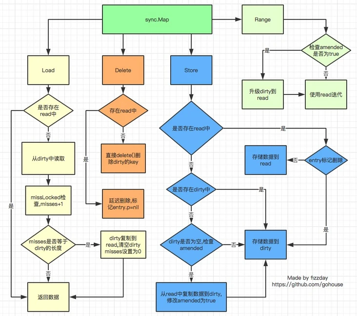

<!-- START doctoc generated TOC please keep comment here to allow auto update -->
<!-- DON'T EDIT THIS SECTION, INSTEAD RE-RUN doctoc TO UPDATE -->
**Table of Contents**  *generated with [DocToc](https://github.com/thlorenz/doctoc)*

- [Overview](#overview)
- [内置map并发写报错](#%E5%86%85%E7%BD%AEmap%E5%B9%B6%E5%8F%91%E5%86%99%E6%8A%A5%E9%94%99)
- [sync.Map使用](#syncmap%E4%BD%BF%E7%94%A8)
- [sync.Map数据结构](#syncmap%E6%95%B0%E6%8D%AE%E7%BB%93%E6%9E%84)
  - [p 的三种状态](#p-%E7%9A%84%E4%B8%89%E7%A7%8D%E7%8A%B6%E6%80%81)
- [大概流程](#%E5%A4%A7%E6%A6%82%E6%B5%81%E7%A8%8B)
- [Store](#store)
- [Load](#load)
- [Delete](#delete)
- [Range](#range)
- [sync.Map没有 Len 方法](#syncmap%E6%B2%A1%E6%9C%89-len-%E6%96%B9%E6%B3%95)
- [总结](#%E6%80%BB%E7%BB%93)

<!-- END doctoc generated TOC please keep comment here to allow auto update -->

# Overview

golang 1.9之后, go 在sync包下引入了并发安全的map 

`sync.Map`的特性:

- 以空间换效率，通过read和dirty两个map来提高读取效率
- 优先从read map中读取(无锁)，否则再从dirty map中读取(加锁)
- 动态调整，当misses次数过多时，将dirty map提升为read map
- 延迟删除，删除只是为value打一个标记，在dirty map提升时才执行真正的删除

`sync.Map` 在两种情况下比较好使：

- 一种是读多写少的情况下
- 一种是当多个goroutine并发读或写不同的key时。

# 内置map并发写报错

```go
func main() {
	s := make(map[string]string)
	for i := 0; i < 99; i++ {
		go func() {
			s["name"] = "stonebird"
		}()
	}
  time.Sleep(1)
	fmt.Printf("进了 %d 只蓝鸟", len(s))
}
```

正在扩容的时候写入会`panic`

```go
// Like mapaccess, but allocates a slot for the key if it is not present in the map.
func mapassign(t *maptype, h *hmap, key unsafe.Pointer) unsafe.Pointer {

  ...
  // 在更新map的函数里检查并发写
	if h.flags&hashWriting == 0 {
		throw("concurrent map writes")
	}
	
  // 在读map的函数里检查是否有并发写
	if h.flags&hashWriting != 0 {
		throw("concurrent map read and map write")
	}
	hash := t.hasher(key, uintptr(h.hash0))

	// Set hashWriting after calling t.hasher, since t.hasher may panic,
	// in which case we have not actually done a write.
	h.flags ^= hashWriting

	...
done:
	if h.flags&hashWriting == 0 {
		throw("concurrent map writes")
	}
	h.flags &^= hashWriting

    ...
```

```bash
fatal error: concurrent map writes
```

# sync.Map使用

```go
package main

import (
	"fmt"
	"sync"
)

func main()  {
	var m sync.Map
	// 1. 写入
	m.Store("qcrao", 18)
	m.Store("stefno", 20)

	// 2. 读取
	age, _ := m.Load("qcrao")
	fmt.Println(age.(int))

	// 3. 遍历
	m.Range(func(key, value interface{}) bool {
		name := key.(string)
		age := value.(int)
		fmt.Println(name, age)
		return true
	})

	// 4. 删除
	m.Delete("qcrao")
	age, ok := m.Load("qcrao")
	fmt.Println(age, ok)

	// 5. 读取或写入
	m.LoadOrStore("stefno", 100)
	age, _ = m.Load("stefno")
	fmt.Println(age)
}
```

# sync.Map数据结构

```go
type Map struct {
	mu sync.Mutex
  read atomic.Pointer[readOnly]
	dirty map[interface{}]*entry
	misses int
}

// readOnly 主要用于存储，通过原子操作存储在Map.read中元素。
type readOnly struct {
	m       map[any]*entry
	amended bool // true if the dirty map contains some key not in m.
}

// 先来看看 dirty，是一个map类型的数据，键的类型是interface{}，而值的类型是*entry，其结构如下
// entry
type entry struct {
	p unsafe.Pointer // *interface{}
}

```

- mu 互斥保护 read 和 dirty。
- `read` 只读数据 `readOnly`
- `dirty` 读写数据，操作 `dirty` 需要用 `mu` 进行加锁来保证并发安全
- `misses` 用于统计有多少次读取 `read` 没有命中
- `amended` 用于标记 `read` 和 `dirty` 的数据是否一致

真正存储 `key/value` 的是 read 和 dirty 字段。`read` 使用 atomic.Value，这是 lock-free 的基础，保证 load/store 的原子性。`dirty` 则直接用了一个原始的 map，对于它的 load/store 操作需要加锁。

## p 的三种状态

当 `p == nil` 时，说明这个键值对已被删除，并且 m.dirty == nil，或 m.dirty[k] 指向该 entry。

当 `p == expunged` 时，说明这条键值对已被删除，并且 m.dirty != nil，且 m.dirty 中没有这个 key。

其他情况，p 指向一个正常的值，表示实际 `interface{}` 的地址，并且被记录在 m.read.m[key] 中。

> read 和 dirty 各自维护一套 key，key 指向的都是同一个 value。也就是说，只要修改了这个 entry，对 read 和 dirty 都是可见的。

# 大概流程



# Store

```go
func (m *Map) Store(key, value interface{}) {
    read, _ := m.read.Load().(readOnly)
    if e, ok := read.m[key]; ok && e.tryStore(&value) {
        return
    }

    m.mu.Lock()
    read, _ = m.read.Load().(readOnly)
    if e, ok := read.m[key]; ok {
        if e.unexpungeLocked() {
            m.dirty[key] = e
        }
        e.storeLocked(&value)
    } else if e, ok := m.dirty[key]; ok {
        e.storeLocked(&value)
    } else {
        if !read.amended {
            m.dirtyLocked()
            m.read.Store(readOnly{m: read.m, amended: true})
        }
        m.dirty[key] = newEntry(value)
    }
    m.mu.Unlock()
}

// 如果 entry 没被删，tryStore 存储值到 entry 中。如果 p == expunged，即 entry 被删，那么返回 false。
func (e *entry) tryStore(i *interface{}) bool {
	for {
		p := atomic.LoadPointer(&e.p)
		if p == expunged {
			return false
		}
		if atomic.CompareAndSwapPointer(&e.p, p, unsafe.Pointer(i)) {
			return true
		}
	}
}
```

- 如果在 read 里能够找到待存储的 key，并且对应的 entry 的 p 值不为 expunged，也就是没被删除时，直接更新对应的 entry 即可。
- 第一步没有成功：要么 read 中没有这个 key，要么 key 被标记为删除。则先加锁，再进行后续的操作。
- 再次在 read 中查找是否存在这个 key，也就是 double check 一下，这也是 lock-free 编程里的常见套路。如果 read 中存在该 key，但 `p == expunged`，说明 m.dirty != nil 并且 m.dirty 中不存在该 key 值 此时: a. 将 p 的状态由 expunged 更改为 nil；b. dirty map 插入 key。然后，直接更新对应的 value。
- 如果 read 中没有此 key，那就查看 dirty 中是否有此 key，如果有，则直接更新对应的 value，这时 read 中还是没有此 key。
- 最后一步，如果 read 和 dirty 中都不存在该 key，
  - a. 如果 dirty 为空，则需要创建 dirty，并从 read 中拷贝未被删除的元素
  - b. 更新 amended 字段，标识 dirty map 中存在 read map 中没有的 key；
  - c. 将 k-v 写入 dirty map 中，read.m 不变。
  - 最后，更新此 key 对应的 value。

# Load

首先是从 `read` 读，没有命中的话会到 `dirty` 读取数据，同时调用 `missLocked()` 增加 `misses`

```go
func (m *Map) Load(key interface{}) (value interface{}, ok bool) {
    read, _ := m.read.Load().(readOnly)
    e, ok := read.m[key]
    if !ok && read.amended {
        m.mu.Lock()
        read, _ = m.read.Load().(readOnly)
        e, ok = read.m[key]
        if !ok && read.amended {
            e, ok = m.dirty[key]
            m.missLocked()
        }
        m.mu.Unlock()
    }
    if !ok {
        return nil, false
    }
    return e.load()
}

func (m *Map) missLocked() {
    m.misses++
    if m.misses < len(m.dirty) {
        return
    }
    m.read.Store(readOnly{m: m.dirty})
    m.dirty = nil
    m.misses = 0
}
```

处理路径分为 fast path 和 slow path，整体流程如下：

1. 首先是 fast path，直接在 read 中找，如果找到了直接调用 entry 的 load 方法，取出其中的值。
2. 如果 read 中没有这个 key，且 amended 为 fase，说明 dirty 为空，那直接返回 空和 false。
3. 如果 read 中没有这个 key，且 amended 为 true，说明 dirty 中可能存在我们要找的 key。当然要先上锁，再尝试去 dirty 中查找。在这之前，仍然有一个 double check 的操作。若还是没有在 read 中找到，那么就从 dirty 中找。不管 dirty 中有没有找到，都要"记一笔"，因为在 dirty 被提升为 read 之前，都会进入这条路径

# Delete

```go
// Delete deletes the value for a key.
func (m *Map) Delete(key interface{}) {
	read, _ := m.read.Load().(readOnly)
	e, ok := read.m[key]
	// 如果 read 中没有这个 key，且 dirty map 不为空
	if !ok && read.amended {
		m.mu.Lock()
		read, _ = m.read.Load().(readOnly)
		e, ok = read.m[key]
		if !ok && read.amended {
			delete(m.dirty, key) // 直接从 dirty 中删除这个 key
		}
		m.mu.Unlock()
	}
	if ok {
		e.delete() // 如果在 read 中找到了这个 key，将 p 置为 nil
	}
}

func (e *entry) delete() (hadValue bool) {
	for {
		p := atomic.LoadPointer(&e.p)
		if p == nil || p == expunged {
			return false
		}
		if atomic.CompareAndSwapPointer(&e.p, p, nil) {
			return true
		}
	}
}
```

基本套路还是和 Load，Store 类似，都是先从 read 里查是否有这个 key，如果有则执行 `entry.delete` 方法，将 p 置为 nil，这样 read 和 dirty 都能看到这个变化。

如果没在 read 中找到这个 key，并且 dirty 不为空，那么就要操作 dirty 了，操作之前，还是要先上锁。然后进行 double check，如果仍然没有在 read 里找到此 key，则从 dirty 中删掉这个 key。但不是真正地从 dirty 中删除，而是更新 entry 的状态。

如果 key 同时存在于 read 和 dirty 中时，删除只是做了一个标记，将 p 置为 nil；而如果仅在 dirty 中含有这个 key 时，会直接删除这个 key。原因在于，若两者都存在这个 key，仅做标记删除，可以在下次查找这个 key 时，命中 read，提升效率。若只有在 dirty 中存在时，read 起不到“缓存”的作用，直接删除。

# Range

```go
func (m *Map) Range(f func(key, value interface{}) bool) {
	read, _ := m.read.Load().(readOnly)
	if read.amended {
		m.mu.Lock()
		read, _ = m.read.Load().(readOnly)
		if read.amended {
			read = readOnly{m: m.dirty}
			m.read.Store(read)
			m.dirty = nil
			m.misses = 0
		}
		m.mu.Unlock()
	}

	for k, e := range read.m {
		v, ok := e.load()
		if !ok {
			continue
		}
		if !f(k, v) {
			break
		}
	}
}
```

为了保证能遍历 `sync.Map` 中所有的 `key`，需要判断 `read.amended` 是否为 `true`。

如果为 `true`，说明只有 `dirty map` 中包含了所有的 `key`，那么就需要将 `dirty map` 转换为 `read map`。（这样的好处是，可以在遍历过程中，不需要加锁）

然后开始遍历，遍历的时候只需要遍历 `read map` 即可，因为这个时候 `read map` 中包含了所有的 `key`。

遍历过程中，如果发现 `key` 已经被删除，则直接跳过。否则将 `key` 和 `value` 传递给 `f` 函数，如果 `f` 函数返回 `false`，那么就停止遍历。

# sync.Map没有 Len 方法

`bcmills` 认为对于并发的数据结构和非并发的数据结构并不一定要有相同的方法。例如，map 有 Len 方法，sync.map 却不一定要有。就像 sync.map 有 LoadOrStore 方法，map 就没有一样。

有些实现增加了一个计数器，并原子地增加或减少它，以此来表示 sync.map 中元素的个数。但 `bcmills` 提出这会引入竞争：`atomic` 并不是 `contention-free` 的，它只是把竞争下沉到了 CPU 层级。这会给其他不需要 Len 方法的场景带来负担。

#  总结

- `sync.Map`对于频繁修改的`map`效率是极高的，但是对于频繁增删的`map`，其效率是还不如使用`sync.RWMutex`的。
- 调用 Load 或 LoadOrStore 函数时，如果在 read 中没有找到 key，则会将 misses 值原子地增加 1，当 misses 增加到和 dirty 的长度相等时，会将 dirty 提升为 read。以期减少“读 miss”。
- 当 dirty 为 nil 的时候，read 就代表 map 所有的数据；当 dirty 不为 nil 的时候，dirty 才代表 map 所有的数据。

