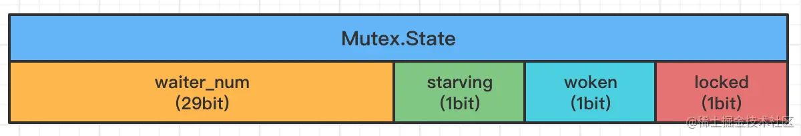

<!-- START doctoc generated TOC please keep comment here to allow auto update -->
<!-- DON'T EDIT THIS SECTION, INSTEAD RE-RUN doctoc TO UPDATE -->
**Table of Contents**  *generated with [DocToc](https://github.com/thlorenz/doctoc)*

- [Overview](#overview)
- [数据结构](#%E6%95%B0%E6%8D%AE%E7%BB%93%E6%9E%84)
  - [sema](#sema)
- [锁的模式](#%E9%94%81%E7%9A%84%E6%A8%A1%E5%BC%8F)
  - [正常模式](#%E6%AD%A3%E5%B8%B8%E6%A8%A1%E5%BC%8F)
  - [饥饿模式](#%E9%A5%A5%E9%A5%BF%E6%A8%A1%E5%BC%8F)
- [加锁](#%E5%8A%A0%E9%94%81)
  - [要想实现自旋，必须符合以下条件](#%E8%A6%81%E6%83%B3%E5%AE%9E%E7%8E%B0%E8%87%AA%E6%97%8B%E5%BF%85%E9%A1%BB%E7%AC%A6%E5%90%88%E4%BB%A5%E4%B8%8B%E6%9D%A1%E4%BB%B6)
  - [加锁总结](#%E5%8A%A0%E9%94%81%E6%80%BB%E7%BB%93)
- [解锁](#%E8%A7%A3%E9%94%81)
- [Mutex不能复制的原因](#mutex%E4%B8%8D%E8%83%BD%E5%A4%8D%E5%88%B6%E7%9A%84%E5%8E%9F%E5%9B%A0)
- [总结](#%E6%80%BB%E7%BB%93)

<!-- END doctoc generated TOC please keep comment here to allow auto update -->

# Overview

Mutex 的实现主要借助了 CAS 指令 + 自旋 + 信号量来实现


# 数据结构

sync.Mutex是一个不可重入的互斥锁。

```go
type Mutex struct {
        state int32
        sema  uint32
}
```

- state  表示当前锁的状态
- sema  是用于控制锁的信号量

Mutex 锁实现了 `Locker` 接口

```go
// A Locker represents an object that can be locked and unlocked.
type Locker interface {
	Lock()
	Unlock()
}
```

## sema

sema信号量的作用：

当持有锁的`gorouine`释放锁后，会释放sema信号量，这个信号量会唤醒之前抢锁阻塞的gorouine来获取锁



waiter_num： 记录了当前等待抢这个锁的goroutine数量

starving： 当前锁是否处于饥饿状态 (后文会详解锁的饥饿状态) 0: 正常状态 1: 饥饿状态

woken： 当前锁是否有goroutine已被唤醒。 0：没有goroutine被唤醒； 1: 有goroutine正在加锁过程

locked： 当前锁是否被goroutine持有。 0: 未被持有  1: 已被持有

# 锁的模式

为了互斥公平性，Mutex 分为 **正常模式** 和**饥饿模式** 两种。

## 正常模式

在正常模式下，等待者 `waiter` 会进入到一个`FIFO`队列，在获取锁时`waiter`会按照先进先出的顺序获取。

当唤醒一个`waiter` 时它被并不会立即获取锁，而是要与`新来的goroutine`竞争，这种情况下新来的goroutine比较有优势，主要是因为它已经运行在CPU，可能它的数量还不少，所以`waiter`大概率下获取不到锁。

在这种`waiter`获取不到锁的情况下，`waiter`会被添加到队列的前面。如果`waiter`获取不到锁的时间超出了1毫秒，它将被切换为饥饿模式。

## 饥饿模式

在饥饿模式下，锁将直接交给队列最前面的`waiter`。新来的goroutine即使在锁未被持有情况下也不会参与竞争锁，同时也不会进行自旋，而直接将其添加到队列的尾部。

如果`拥有锁的waiter`发现有以下两种情况，它将切换回正常模式：

1. 它是队列里的最后一个waiter，再也没有其它waiter
2. 等待时间小于1毫秒

# 加锁

加锁对应的方法是`Lock()`

```go
func (m *Mutex) Lock() {
	// Fast path: grab unlocked mutex.
	// 锁未被持有，则直接获取持有权
	if atomic.CompareAndSwapInt32(&m.state, 0, mutexLocked) {
		if race.Enabled {
			race.Acquire(unsafe.Pointer(m))
		}
		return
	}
	// Slow path (outlined so that the fast path can be inlined)
	// 尝试自旋竞争或饥饿状态下饥饿goroutine竞争
	m.lockSlow()
}
```

先是 `fast path` 幸运路径，使用 CAS 直接获取锁，如果运气好的话会直接获取到锁并返回。如果获取不到则 `slow path`，这里是 `lockSlow()`函数，其实现比较复杂。

```go
func (m *Mutex) lockSlow() {
	var waitStartTime int64 // 当前waiter开始等待时间
	starving := false // 当前饥饿状态
	awoke := false // 当前唤醒状态
	iter := 0 // 当前自旋次数
	old := m.state // 当前锁的状态
	for {
		// Don't spin in starvation mode, ownership is handed off to waiters
		// so we won't be able to acquire the mutex anyway.
		// 在饥饿模式下不需要自旋，直接将锁移交给waiter（队列头部的waiter)，因此新来的goroutine永远也不会获取锁

		// 正常模式下，锁被其它goroutine持有,如果当前允许spinning, 则尝试进行自旋
		if old&(mutexLocked|mutexStarving) == mutexLocked && runtime_canSpin(iter) {
			// Active spinning makes sense.
			// Try to set mutexWoken flag to inform Unlock
			// to not wake other blocked goroutines.
			if !awoke && old&mutexWoken == 0 && old>>mutexWaiterShift != 0 &&
				atomic.CompareAndSwapInt32(&m.state, old, old|mutexWoken) {
				awoke = true // 设置当前goroutine唤醒成功
			}
			runtime_doSpin() // 自旋
			iter++ // 当前自旋次数+1
			old = m.state // 当前goroutine再次获取锁的状态，之后会检查是否锁被释放了
			continue // 重新判断spinning
		}

		......
	}

	......
}
```

> 在饥饿模式下不需要自旋，直接将锁移交给waiter（队列头部的waiter)，因此新来的goroutine永远也不会获取锁

## 要想实现自旋，必须符合以下条件

- 非饥饿模式
- 自旋的次数<4 
- CPU必须为多核处理器
- 当前程序中设置的 `gomaxprocs` 个数 >（空闲P个数 + 当前处于自旋m的个数 + 1）
- 至少有一个正在运行的P的本地运行队列为空

## 加锁总结

- Lock()函数 
- 判断这个锁是否未初始化，如果该锁没有初始化，则对该锁进行初始化设置，然后获取锁，Lock()函数返回。如果该锁已被初始化过，则进入下一步操作。
- 判断锁与协程的当前状态
  - 饥饿状态直接将锁移交给waiter（队列头部的waiter)，因此新来的goroutine永远也不会获取锁
  - 如果该锁处于加锁状态且当前协程不处于饥饿状态，则尝试获取该锁的协程会进入自旋状态（最多自旋4次）。
- 自旋完成后，计算当前锁的状态，协程尝试获取锁，如果获取成功，Lock()函数返回。如果获取失败，则进入下一步操作。
- 自旋完成后尝试获取锁失败，该协程进入休眠状态，协程进入阻塞状态，并不断尝试获取信号。
- 休眠协程获取到信号（有其他协程释放了锁），被唤醒，此时go会判断当前协程是否处于饥饿状态（如果协程从调用Lock()函数起，超过1ms后都没有成功获取到锁，则该协程进入饥饿状态）。如果该协程处于饥饿状态，不会启动自旋过程，而是再次被阻塞，一旦有其他的协程释放了锁，那么该饥饿协程就会被唤醒并直接获取锁，Lock()函数返回。如果该协程处于正常状态，则进入下一步操作。
- 如果协程被判定处于正常状态，即满足再次启动自旋条件（协程从调用Lock()函数起到现在被唤醒的总时间不超过`1ms`），则重置自旋次数，再次启动自旋，尝试获取锁。如果自旋结束后，该协程还是没有获取到锁，则回到步骤
- 开始新一轮循环。

# 解锁

对于Mutex 解锁来说，在一个goroutine里加锁，在另一个goroutine是可以实现解锁的。但千万不要重复解锁，否则会触发panic。一般要遵循谁加锁，就由谁来解锁，即“ 解锁还须系铃人 ” 规则。

解锁对应的方法为 `Unlock()`

```go
func (m *Mutex) Unlock() {
	// Fast path: drop lock bit.
	new := atomic.AddInt32(&m.state, -mutexLocked)
	// 如果 new=0 表示恢复了锁的默认初始化状态，否则表示锁仍在使用
	// 解锁失败
	if new != 0 {
		// Outlined slow path to allow inlining the fast path.
		// To hide unlockSlow during tracing we skip one extra frame when tracing GoUnblock.
		m.unlockSlow(new)
	}
}


func (m *Mutex) unlockSlow(new int32) {
	// 未加锁状态，直接解锁出错
	if (new+mutexLocked)&mutexLocked == 0 {
		throw("sync: unlock of unlocked mutex")
	}

	// 正常模式 （当前m.state & mutexStarving ==0,则说明 m.state 的 mutexStarving 位是0）
	if new&mutexStarving == 0 {
    
  }else{
    // 饥饿模式，将当前锁控制权直接交给下一个waiter
		runtime_Semrelease(&m.sema, true, 1)
  }
}
```

解锁源码比较好理解，对于`slow path` 而言

- 饥饿模式直接调用函数`runtime_Semrelease()`，通过信号量将锁控制权交给下一个waiter。
- 正常模式下
  - 如果等待队列里没有 `waiter` 或 锁为 `被持有状态`、`唤醒状态`、`饥饿状态`三者其中条件之一，则直接返回并结束处理逻辑；
  - 当前goroutine抢锁的控制权。先读取m.state的值，waiters数量减少1，并修改状态为唤醒标记，最后通过CAS修改m.state，如果修改成功则表示抢锁控制权成功，即解锁成功，则直接结束
  - 否则重新读取m.state 的值，for 循环新一轮的逻辑

# Mutex不能复制的原因

使用 Mutex 是为了不同 goroutine 之间共享某个变量, 所以需要让这个变量做到能够互斥, 不然该变量就会被互相被覆盖.

Mutex 底层是由 `state` `sema` 控制的, 当 Mutex 变量被复制时, Mutex 的 state, sema 当时的状态也被复制走了, 但是由于不同 goroutine 之间的 Mutex 已经不是同一个变量了,

这样就会造成要么某个 goroutine 死锁或者不同 goroutine 共享的变量达不到互斥

# 总结

- 不同 goroutine 可以 Unlock 同一个 Mutex，但是 Unlock 一个无锁状态的 Mutex 就会报错。
  - 一般要遵循谁加锁，就由谁来解锁，即“ 解锁还须系铃人 ” 规则。
- Mutex 不是可重入锁
  - Mutex 不会记录持有锁的协程的信息，所以如果连续两次 Lock 操作，就直接死锁了。