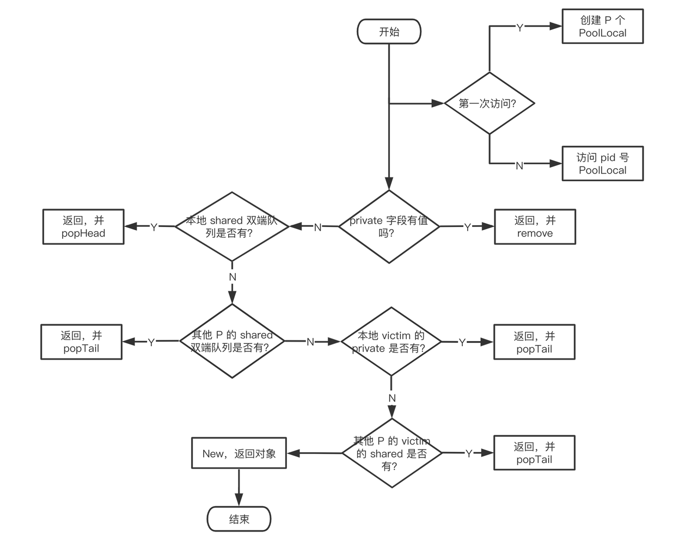

<!-- START doctoc generated TOC please keep comment here to allow auto update -->
<!-- DON'T EDIT THIS SECTION, INSTEAD RE-RUN doctoc TO UPDATE -->
**Table of Contents**  *generated with [DocToc](https://github.com/thlorenz/doctoc)*

- [Overview](#overview)
- [简单用法](#%E7%AE%80%E5%8D%95%E7%94%A8%E6%B3%95)
- [数据结构](#%E6%95%B0%E6%8D%AE%E7%BB%93%E6%9E%84)
- [Get](#get)
- [Put](#put)
- [Gc](#gc)
- [sync.Pool 的性能之道](#syncpool-%E7%9A%84%E6%80%A7%E8%83%BD%E4%B9%8B%E9%81%93)

<!-- END doctoc generated TOC please keep comment here to allow auto update -->

# Overview

sync.Pool 是 Golang 内置的对象池技术，可用于缓存临时对象，避免因频繁建立临时对象所带来的消耗以及对 GC 造成的压力。

sync.Pool 作为 goroutine 内置的官方库，其设计非常精妙。sync.Pool 不仅是并发安全的，而且实现了 lock free

# 简单用法

需要初始化 Pool，唯一需要的就是设置好 New 函数。当调用 Get 方法时，如果池子里缓存了对象，就直接返回缓存的对象。如果没有存货，则调用 New 函数创建一个新的对象。

```Go
package main

import (
        "fmt"
        "log"
        "sync"
        "time"
)

type Cache struct {
        Name string
        Age  int
}

var done = false
var pool sync.Pool
var wg sync.WaitGroup

func main() {
        pool.New = func() interface{} {
                return new(Cache)
        }

        cond := sync.NewCond(&sync.Mutex{})

        wg.Add(4)
        // 消费者1
        go func(c *sync.Cond) {
                defer wg.Done()
                c.L.Lock()
                for !done {
                        c.Wait()
                }
                c.L.Unlock()
                cache, ok := pool.Get().(*Cache)
                if ok {
                        fmt.Printf("cache1 %#v\n", cache)
                }
                pool.Put(cache)
        }(cond)

        // 消费者2
        go func(c *sync.Cond) {
                defer wg.Done()
                c.L.Lock()
                for !done {
                        c.Wait()
                }
                c.L.Unlock()
                time.Sleep(time.Second)
                cache, ok := pool.Get().(*Cache)
                if ok {
                        fmt.Printf("cache2 %#v\n", cache)
                }
                pool.Put(cache)
        }(cond)

        //  消费者3
        go func(c *sync.Cond) {
                defer wg.Done()
                c.L.Lock()
                for !done {
                        c.Wait()
                }
                c.L.Unlock()
                time.Sleep(time.Second * 2)
                cache, ok := pool.Get().(*Cache)
                if ok {
                        fmt.Printf("cache3 %#v\n", cache)
                }
        }(cond)
        // 生产者
        go func(c *sync.Cond) {
                defer wg.Done()
                c.L.Lock()
                done = true
                cache := &Cache{
                        Name: "hu",
                        Age:  18,
                }
                pool.Put(cache)
                // pool.Put(cache)
                // pool.Put(cache)
                c.L.Unlock()
                log.Println("wakes all")
                c.Broadcast()
        }(cond)

        wg.Wait()
}
```

# 数据结构

```Go
type Pool struct {
  // 用于检测 Pool 池是否被 copy，因为 Pool 不希望被 copy；
  // 有了这个字段之后，可用用 go vet 工具检测，在编译期间就发现问题；
  noCopy noCopy  
  
  // 数组结构，对应每个 P，数量和 P 的数量一致；
  local     unsafe.Pointer 
  localSize uintptr        

  // GC 到时，victim 和 victimSize 会分别接管 local 和 localSize；
  // victim 的目的是为了减少 GC 后冷启动导致的性能抖动，让分配对象更平滑；
  victim     unsafe.Pointer 
  victimSize uintptr      

  // 对象初始化构造方法，使用方定义
  New func() interface{}
}
```

- noCopy 是 Golang 源码中禁止拷贝的检测方法。可以通过 go vet 命令检测出 sync.Pool 的拷贝。
- local 是个数组，长度为 P 的个数。其元素类型是 poolLocal。这里面存储着各个 P 对应的本地对象池。可以近似的看做 [P]poolLocal。通过这样设计，每个P都有自己本地的poolLocal，减少了**锁竞争**
- localSize。代表 local 数组的长度。因为 P 可以在运行时通过调用 runtime.GOMAXPROCS 进行修改, 因此我们还是得通过 localSize 来对应 local 数组的长度。
- victim 和 victimSize。这一对变量代表了上一轮清理前的对象池，其内容语义 local 和 localSize 一致。victim 的作用还会在下面详细介绍到。
- New 就是用户提供的创建对象的函数。这个选项也不是必需。当不填的时候，Get 有可能返回 nil。

# Get

```Go
func (p *Pool) Get() any {
   l, pid := p.pin()
   x := l.private
   l.private = nil
   if x == nil {
   x, _ = l.shared.popHead()
      if x == nil {
         x = p.getSlow(pid)
      }
   }
   runtime_procUnpin()
   
   if x == nil && p.New != nil {
      x = p.New()
   }
   return x
}
```

- 首先，调用 p.pin() 函数将当前的 goroutine 和 P 绑定，禁止被抢占，返回当前 P 对应的 poolLocal，以及 pid。
- 然后直接取 l.private，赋值给 x，并置 l.private 为 nil。
- 判断 x 是否为空，若为空，则尝试从 l.shared 的头部 pop 一个对象出来，同时赋值给 x。
- 如果 x 仍然为空，则调用 getSlow 尝试从其他 P 的 shared 双端队列尾部“偷”一个对象出来。
- Pool 的相关操作做完了，调用 runtime_procUnpin() 解除非抢占。
- 最后如果还是没有取到缓存的对象，那就直接调用预先设置好的 New 函数，创建一个出来。



# Put

```Go
// Put 将对象添加到 Pool 
func (p *Pool) Put(x interface{}) {
        if x == nil {
                return
        }
        // ……
        l, _ := p.pin()
        if l.private == nil {
                l.private = x
                x = nil
        }
        if x != nil {
                l.shared.pushHead(x)
        }
        runtime_procUnpin()
    //…… 
}
```

先绑定 g 和 P，然后尝试将 x 赋值给 private 字段。

如果失败，就调用 pushHead 方法尝试将其放入 shared 字段所维护的双端队列中。

# Gc

```Go
func init() {
   runtime_registerPoolCleanup(poolCleanup)
}

func poolCleanup() {
   for _, p := range oldPools {
      p.victim = nil
      p.victimSize = 0
   }

   for _, p := range allPools {
      p.victim = p.local
      p.victimSize = p.localSize
      p.local = nil
      p.localSize = 0
   }

    oldPools, allPools = allPools, nil
}
```

该代码会在gc STW阶段进行

清除每个pool的victim

将每个pool的local移动到victim

为啥要清除victim：

避免数据长时间占用内存，造成内存泄露

这里不至于一次性把所有的 Pool 都清空了，而是需要两个GC周期才会被释放

# sync.Pool 的性能之道

- 回顾下 sync.Pool 的实现细节，总结来说，sync.Pool 利用以下手段将程序性能做到了极致：
- 利用 GMP 的特性，为每个 P 创建了一个本地对象池 poolLocal，尽量减少并发冲突。
- 每个 poolLocal 都有一个 private 对象，优先存取 private 对象，可以避免进入复杂逻辑。
- 在 Get 和 Put 期间，利用 pin 锁定当前 P，防止 goroutine 被抢占，造成程序混乱。
- 在获取对象期间，利用对象窃取的机制，从其他 P 的本地对象池以及 victim 中获取对象。
- 充分利用 CPU Cache 特性，提升程序性能。